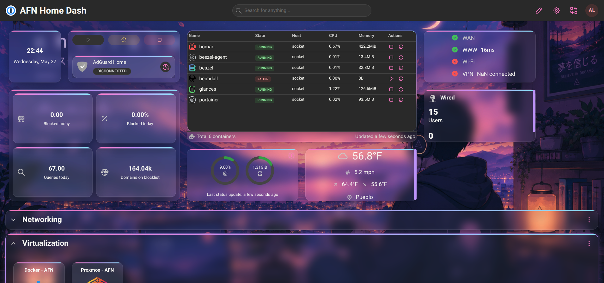

# Homarr Dashboard Configuration

A minimalist, highly curated personal homelab dashboard powered by **Homarr**. This repository contains the configuration files, custom icons, and structural layout for a streamlined self-hosted navigation hub.

## 🛠️ Features

* **Grid Layout**: Organized into logical categories (Core, Media, Infrastructure, Automation).
* **Minimalist Design**: High-contrast dark mode using desaturated accent colors.
* **Custom Integration**: Integrated status widgets for Docker containers, Pi-hole, and Plex.
* **Ping Monitoring**: Built-in visual indicators for service uptime and response latency.

## Screenshots:


## 📁 Repository Structure

```text
├── configs/
│   └── settings.json      # Core Homarr configuration & layouts
├── icons/
│   └── custom/            # Hand-picked minimalist SVG icons
└── README.md              # Documentation
